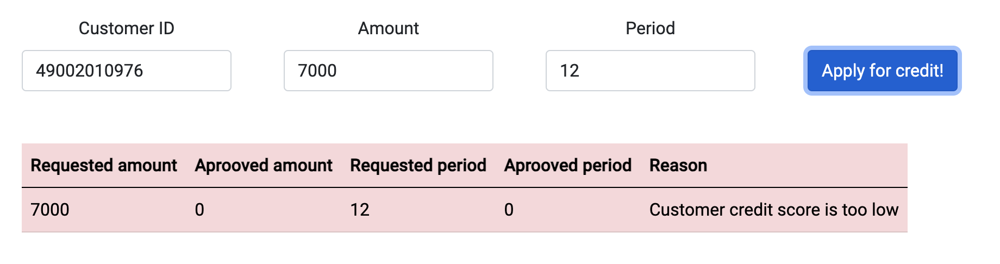

# CreditDecisionApp
## The Overview
A simple decision engine that implements a logic to make a loan decision based on customer credit score, requested load amount and period. The credit score is calculated using simple algoritm (instead of making a call to some external service as it would normally do in a real life):
<br/><br/>
***credit score = (credit modifier / loan amount) * loan period***
<br/><br/>
There is a predefined map of customers and their credit modifiers:
- 49002010965 - has debt
- 49002010976 - 100
- 49002010987 - 300
- 49002010998 - 1000
<br/>
So there can be 4 different scenarios + the case when the score cannot be obtained due to invalid customerId provided:
<br/>
1. Customer has debt and credit decision gets rejected
<p align="left">
  
</p>
2. Credit score is too low for requested amount and period, the service cannot offer any decreased amount, so the decision gets rejected
<p align="left">
  
</p>
3. Credit score is still low, but the service can offer smaller amount (and maybe change the period as well)
<p align="left">
  
</p>
4. Credit score is good and a higher amount can be aprooved
<p align="left">
  
</p>
<br/>
5. No customer data available, so the service is unable to make any decision
<p align="left">
  
</p>
<br/>
6. There can be also a 400 Bad request error case and a basic alert message is shown
<p align="left">
  
</p>

## How to run
1. Start backend server:
```shell
cd CreditDecisionApp/credit-decision-service/
./mvnw spring-boot:run
```
* use  ```mvnw.cmd``` for the Windows environment if you don't have maven installed
* server default port is 8084
  
2. Start the client:
```shell
cd CreditDecisionApp/credit-decision-client/
npm install
ng serve --open
```
* client opens on port 4200
